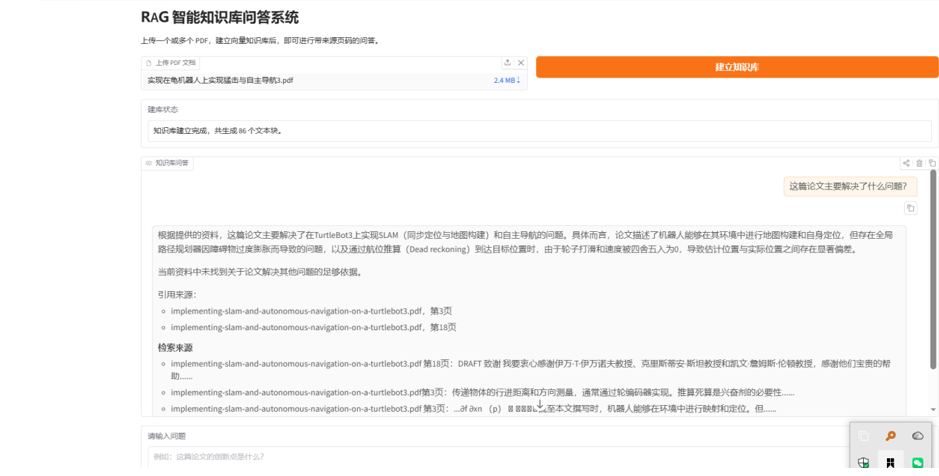
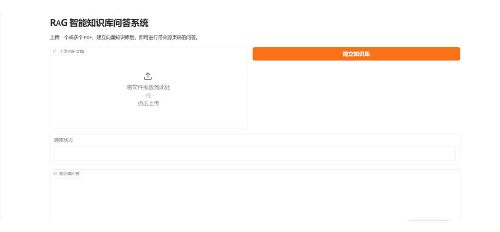

# RAG 智能知识库问答系统

<p align="center">
  <a href="#快速开始">快速开始</a> ·
  <a href="#使用演示">使用演示</a> ·
  <a href="#系统架构">系统架构</a> ·
  <a href="#配置说明">配置说明</a>
</p>

<p align="center">
  
  
  
  
</p>

> 基于 **BGE Embedding + FAISS + DeepSeek/Qwen + Gradio** 的多文档检索增强生成（RAG）应用。上传 PDF、构建本地知识库，即可获得带文件名和页码引用的回答。



## 项目背景

通用大语言模型无法直接访问用户的论文、企业文档或内部资料，并且可能生成缺乏依据的回答。本项目通过 RAG 流程先检索外部知识，再将相关文档片段交给大模型生成答案，使回答能够基于真实文档内容。

## 功能亮点

- 支持一次上传多个 PDF 文档
- 自动完成 PDF 解析、文本切分和向量化
- 使用 BGE 中文向量模型与 FAISS 进行语义检索
- 支持 DeepSeek 或 Qwen 的 OpenAI 兼容接口
- 回答中展示文件名、页码和检索片段
- 支持多轮对话历史
- 向量库只在需要时加载，避免每次提问重复初始化
- 提供 Gradio Web 界面与异常提示

## 使用演示

### 上传并建立知识库



### 基于文档的问答与来源追溯

系统会在回答后展示命中的文档名称、页码与文本片段，便于核验信息来源。


## 系统架构

```text
多个 PDF 文档
      ↓
PyPDF 文档解析
      ↓
RecursiveCharacterTextSplitter
      ↓
BGE Embedding
      ↓
FAISS 向量数据库
      ↑
用户问题 → Query Embedding → Top-K 检索
                              ↓
                     DeepSeek / Qwen
                              ↓
                答案 + 文件名 + 页码
```

## 项目结构

```text
RAG-Knowledge-QA-System/
├── configs/
│   └── config.yaml
├── src/
│   ├── config.py
│   ├── document_loader.py
│   ├── vector_store.py
│   ├── llm_client.py
│   ├── rag_pipeline.py
│   └── app.py
├── scripts/
│   └── run_app.py
├── data/
├── vector_db/
├── assets/
├── results/
├── tests/
├── .env.example
├── requirements.txt
├── .gitignore
└── README.md
```

## 环境要求

- Python 3.10
- Windows 或 Linux
- DeepSeek/Qwen API Key
- 首次运行需要下载 BGE 模型

## 快速开始

### 1. 创建环境并安装依赖

```bash
conda create -n rag_qa python=3.10 -y
conda activate rag_qa
pip install -r requirements.txt
```

### 2. 配置模型 API

从示例文件创建本地配置：

```bash
# macOS / Linux
cp .env.example .env

# Windows PowerShell
Copy-Item .env.example .env
```

### DeepSeek

```env
OPENAI_API_KEY=你的DeepSeek_API_Key
OPENAI_BASE_URL=https://api.deepseek.com
```

配置文件：

```yaml
llm_model: deepseek-chat
```

### Qwen

```env
OPENAI_API_KEY=你的DashScope_API_Key
OPENAI_BASE_URL=https://dashscope.aliyuncs.com/compatible-mode/v1
```

并修改：

```yaml
llm_model: qwen-plus
```

### 3. 启动应用

在项目根目录执行：

```bash
python -m src.app
```

启动后，在浏览器访问：

```text
http://127.0.0.1:7860
```

### 使用步骤

1. 上传一个或多个 PDF。
2. 点击“建立知识库”。
3. 等待建库完成。
4. 输入问题并查看答案及来源页码。

## 配置说明

`configs/config.yaml`：

```yaml
embedding_model: BAAI/bge-small-zh-v1.5
vector_store_path: vector_db
chunk_size: 500
chunk_overlap: 100
top_k: 4
llm_provider: deepseek
llm_model: deepseek-chat
temperature: 0.2
```

调整建议：

- 论文结构复杂时，可将 `chunk_size` 调整到 700。
- 回答缺少上下文时，可将 `top_k` 调整到 5 或 6。
- 回答过于发散时，保持 `temperature` 在 0.1 到 0.3。

## 示例问题

```text
这篇论文主要解决了什么问题？
该方法的创新点有哪些？
实验使用了哪些评价指标？
作者如何设计奖励函数？
```

## 输出示例

```text
该论文提出了一种面向复杂环境的路径规划方法……

引用来源：
- paper_a.pdf，第4页
- paper_a.pdf，第7页
```

## 测试

```bash
pytest
```

## 简历描述

**基于 RAG 的多文档智能知识库问答系统**

- 构建支持多 PDF 上传的 RAG 知识库问答系统，实现文档解析、文本切分、向量化存储与语义检索。
- 使用 BGE 中文 Embedding 与 FAISS 完成 Top-K 文档召回，并接入 DeepSeek/Qwen 生成基于私有资料的回答。
- 设计文件名与页码引用机制，支持多轮对话及检索来源展示，提高回答可追溯性。
- 基于 Gradio 搭建 Web 交互界面，并通过 YAML 与环境变量管理模型及 API 配置。

## 后续计划

- 增加 BM25 + 向量检索的 Hybrid Search
- 增加 BGE Reranker
- 增加 Word、Markdown 和网页文档支持
- 增加检索准确率评估集

## 安全说明

- 请勿提交 `.env`、API Key、上传的私有 PDF 或本地生成的向量库。
- 本项目已通过 `.gitignore` 排除这些本地敏感文件；提交前仍建议执行 `git status` 进行确认。
